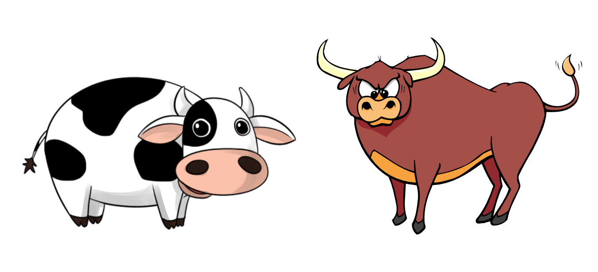

# CowsAndBulls

## How to play

1. Create a New Game
2. Join the Game and wait for all other players to join
3. Start the Game after all players have joined
4. When its your turn (Host), give a 4 letter word for others to guess
5. Everyone else (Guessers) try to figure that word by guessing isogram words containing the same number of letters
6. Cows & Bulls for each guessed word will be displayed on the screen.
7. "Cow" means a letter in the wrong position, while "Bull" means a letter in the right position.

### Example

> For example, if the secret word is **HEAT**, a guess of **COIN** would result in **"0 Bulls, 0 Cows"** (_all of the guessed letters are wrong_); a guess of **EATS** would result in **"0 Bulls, 3 Cows"** (_since **E**, **A**, **T** are all present, but not in the guessed positions_</em>_), and a guess of **TEAL** would result in **"2 Bulls, 1 Cow"** (\_since **E** and **A** are in the right positions, while **T** is in the wrong position_). The game would continue until someone scores **"4 Bulls"** for guessing **HEAT** exactly.
